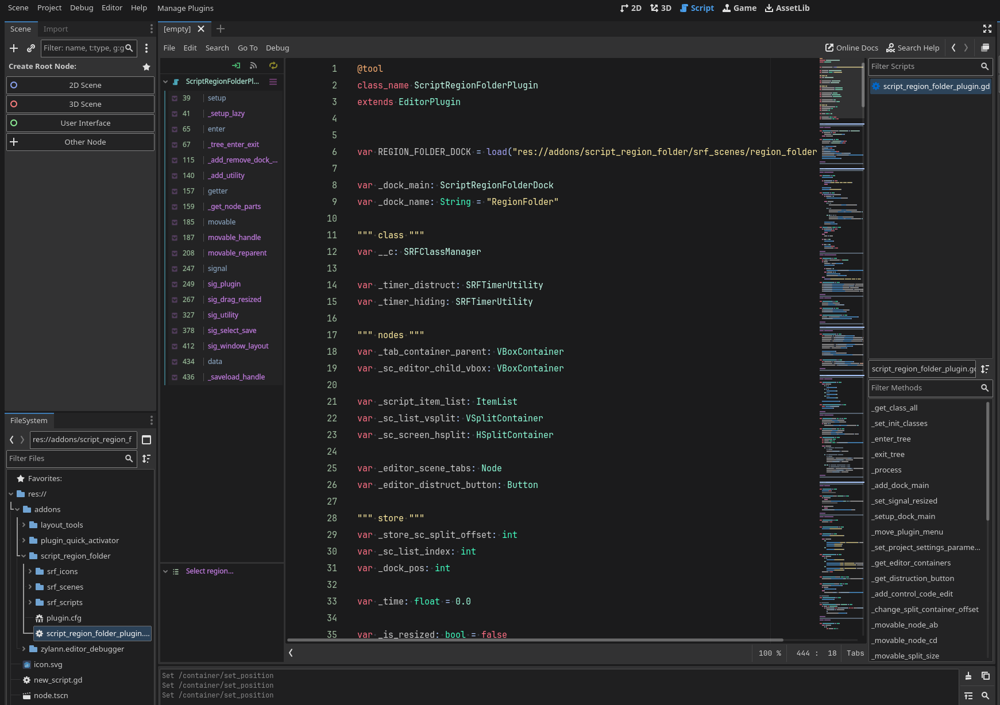
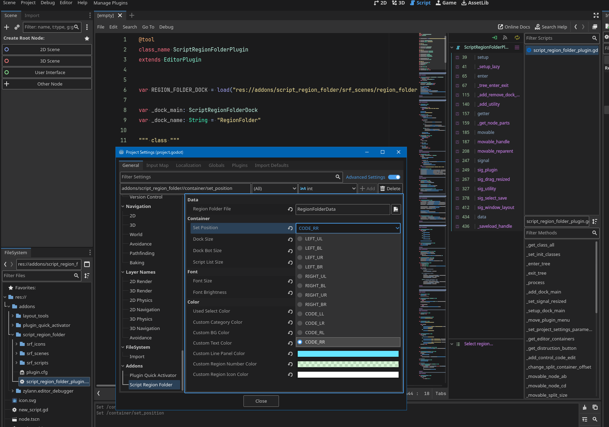
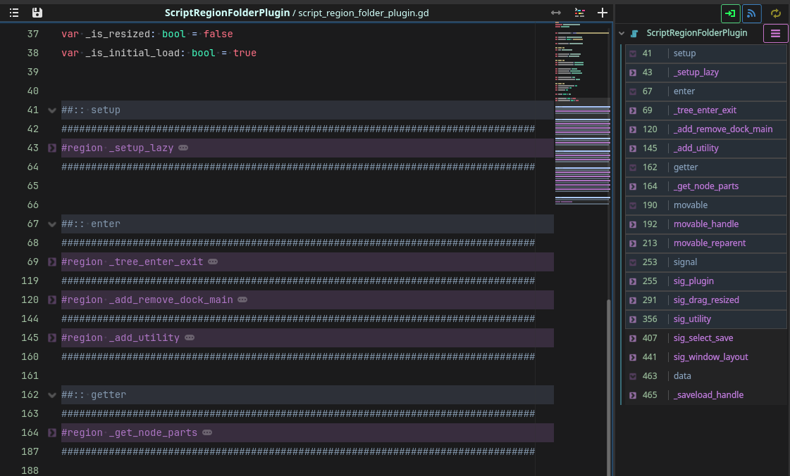
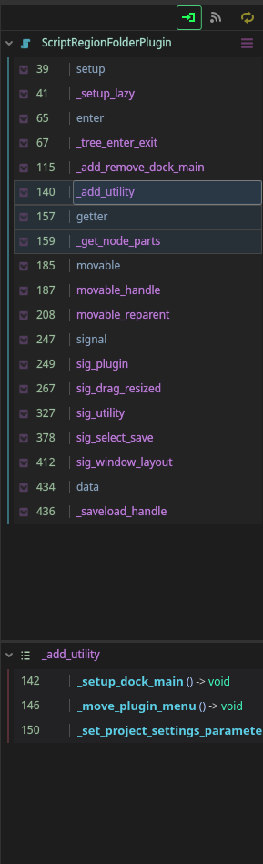
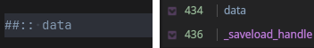
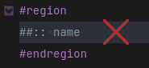
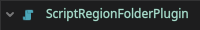
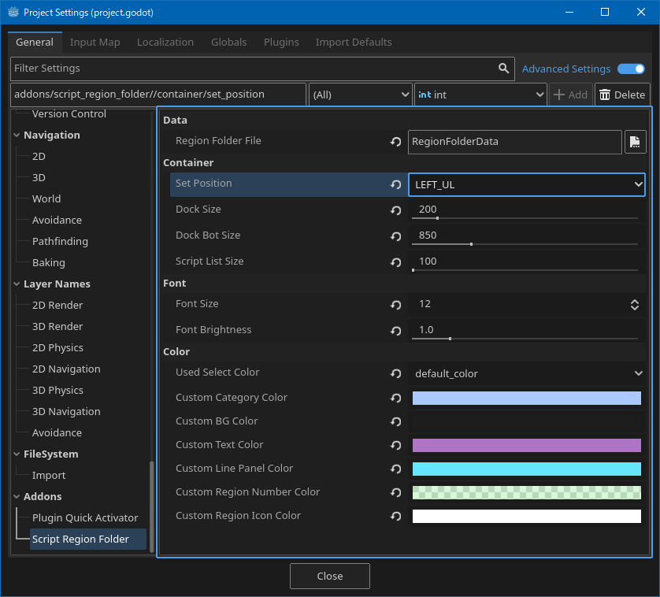
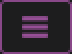
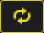

[&labelColor=deepskyblue)](./LICENSE)

 

# Script Region Folder

Displays a list of the Regions you have created.

 

## Overview

  - Set Position Code_LR

 

  - Set Position Code_RR
  

 

  - All fold

 

  - Folder

 

 

## Region Features

Typing ##:: (sharp x 2, colon x 2 Naming) 

at the beginning will create a category line.

 

Category lines cannot be created in the middle of regions.

 

By clicking the class name in the region folder, you can jump to the beginning of the selected class.

 

You can expand or collapse a region by clicking the fold icon.

 
 

> [!CAUTION]
> ### If the regions are not displayed correctly after saving, click on the ScriptEditor.

##

 

# Settings

> [!note]
> The addon settings can be found at the bottom of the Project Settings under the item Script Region Folder.
> 
> The save data will be placed in the current project folder.

 

> [!important]
> If you change the Set Position, a restart of the addon is required.

 

## Settings Items

- Region Folder File ( Name for the save file )

- Set Position ( Dock position at startup )

- Used Select Color ( Used select color switches between default and custom colors )

 

# ICONS

> [!tip]
>
> ### When jumping to a selected region, turn ON the [ Focus Button ]
>
> ### If the regions are not displayed, press the [ Manual Refresh button ]

 
 

## All fold / All unfold

Opens or closes the region of the selected class.

 
 

## Focus Button

If true, selecting a region name focuses the editor on that line.

 
 

## Auto Refresh Button

Automatically updates the region list on code changes. (May be slightly slower.)

 
 

## Manual Refresh Button

Refreshes regions of the selected class.

 
 

